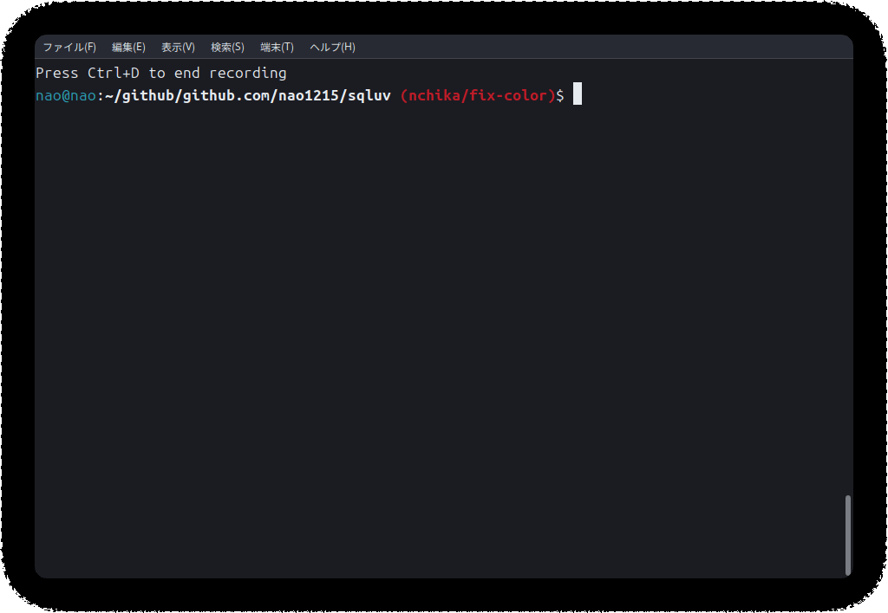
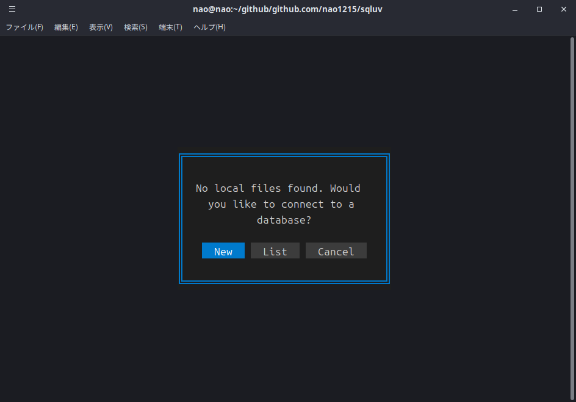
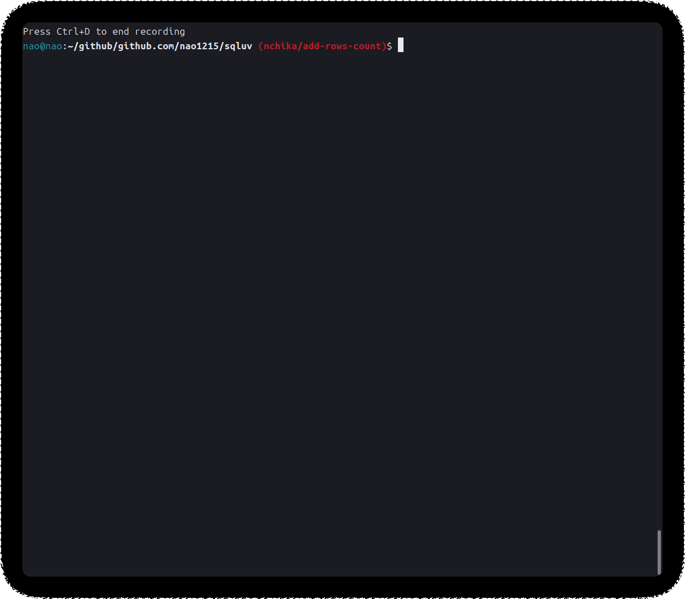

The **sqluv (sql + love)** provides a simple text user interface for multiple DBMSs and CSV/TSV/LTSV (local/http/https/s3) files. The sqluv automatically decompresses compressed files in gz, bz2, xz, and zst formats. You execute SQL queries for the connected DBMS or local/http/https files. The sqluv has the color theme feature, so you can change the color theme to your liking.

The sqluv is a command derived from [nao1215/sqly](https://github.com/nao1215/sqly). Its starting point is to provide a more user-friendly interface for writing SQL compared to sqly.

>[!WARNING]
> sqluv is under development. You use sqluv for **viewer**. Do not execute UPDATE or DELETE in the production environment. sqluv can not update or delete data in the local file, but it can update or delete data in the connected DBMS.

## How to install
### Use "go install"

```shell
go install github.com/nao1215/sqluv@latest
```

### Use homebrew

```shell
brew install nao1215/tap/sqluv
```

## Supported OS, File Format, Compressed Format, DBMS, go version

- Windows/macOS/Linux
- CSV/TSV/LTSV (file://, http://, https://)
- gz/bz2/xz/zst
- MySQL/PostgreSQL/SQLite3/SQL Server
- go1.24 or later

## How to use

### Syntax

```shell
sqluv [FILE_PATHS/HTTP URL/HTTPS URL]  ※ Supported file formats: CSV, TSV, LTSV
```

### Connect to DBMS

When you start the sqluv command without specifying a file path, the following screen will appear. 



Please enter the connection information for the DBMS you want to connect to.


If the connection is successful, database connection information will be saved in the configuration file. The next time you start the sqluv command, you will be able to select the DBMS you want to connect to from the list.


## SQL query history

If you execute a SQL query, the history will be saved in the `~/.config/sqluv/history.db`. So, you can look up the history by pressing the history button.


If you select a history, the SQL query will be copied to the query text area.


### Read from a file

Please specify a file path (or url) when executing the sqluv command. The file will be loaded before launching the TUI. When the sqluv import csv/tsv/ltsv, the sqluv checks the file extension and determines the file format. If the file extension is not csv/tsv/ltsv, the sqluv will display an error message. The sqluv does not automatically detect the file format.



## Key bindings

| Key | Description |
| --- | --- |
| ESC | Quit |
| Ctrl + d | Quit |
| Ctrl + c | Copy the selected sql query |
| Ctrl + v | Paste the copied text |
| Ctrl + x | Cut the selected text |
| Ctrl + t | Change the theme |
| TAB | Move to the next field |
| Shift + TAB | Move to the previous field |

## Color theme

### Defaulut


### Sublime


### VS Code


### Atom


### Dark


### Light


### Solarized


### Monokai


### Nord


### Cappuccino


### Gruvbox


### Tokyo Night


### Dracula


## Altenative Tools

|Name | Description |
|:----|:------------|
| [jorgerojas26/lazysql](https://github.com/jorgerojas26/lazysql) |A cross-platform TUI database management tool written in Go.|
| [vladbalmos/mitzasql](https://github.com/vladbalmos/mitzasql) | MySQL command line / text based interface client |
| [TaKO8Ki/gobang](https://github.com/TaKO8Ki/gobang) | A cross-platform TUI database management tool written in Rust |


## Contributing

First off, thanks for taking the time to contribute! See [CONTRIBUTING.md](./CONTRIBUTING.md) for more information. Contributions are not only related to development. For example, GitHub Star motivates me to develop! 


[](https://star-history.com/#nao1215/sqluv&Date)

## Contact
If you would like to send comments such as "find a bug" or "request for additional features" to the developer, please use one of the following contacts.

- [GitHub Issue](https://github.com/nao1215/sqluv/issues)

## LICENSE

[MIT License](./LICENSE)

