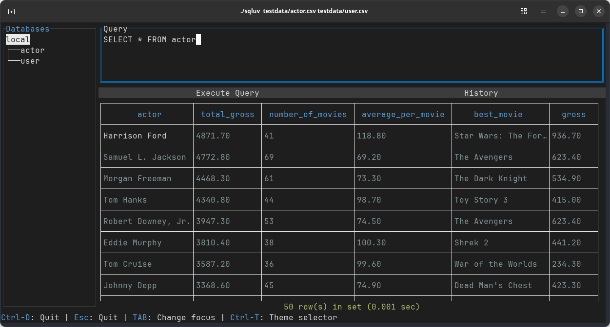
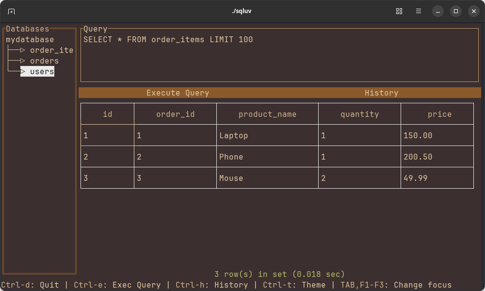

The **sqluv (sql + love)** is a straightforward text-based user interface designed for interacting with various Relational Database Management Systems (RDBMS) as well as CSV, TSV, and LTSV files. The sqluv read CSV, TSV, and LTSV files from local storage, HTTPS, and Amazon S3. The sqluv automatically decompresses compressed files in .gz, .bz2, .xz, and .zst formats.With sqluv, executing SQL queries becomes a user-friendly experience, allowing seamless connections to databases or local files with ease.

The sqluv is a command derived from [nao1215/sqly](https://github.com/nao1215/sqly). Its starting point is to provide a more user-friendly interface for writing SQL compared to sqly.

>[!WARNING]
> sqluv is under development. You use sqluv for **viewer**. Do not execute UPDATE or DELETE in the production environment.

## Key Features
- Multi-DBMS Support: Connect and interact with popular database systems like MySQL, PostgreSQL, SQLite3, and SQL Server.
- File Compatibility: Read data from files in CSV, TSV, and LTSV formats from HTTPS, S3, and local storage.
- Support Compressed File: Automatically decompresses compressed files in .gz, .bz2, .xz, and .zst.
- Query History: Save and access SQL query history for easy reference. Fuzzy search is also available.
- Customizable Themes: sqluv supports multiple color themes, enabling customization of the interface based on user preference.

## How to install
### Use "go install"

```shell
go install github.com/nao1215/sqluv@latest
```

### Use homebrew

```shell
brew install nao1215/tap/sqluv
```

## Supported OS, File Format, Compressed Format, DBMS, go version

- Windows/macOS/Linux
- CSV/TSV/LTSV (file://, http://, https://)
- gz/bz2/xz/zst
- MySQL/PostgreSQL/SQLite3/SQL Server
- go1.24 or later

## How to use

### Syntax

The sqluv interface prioritizes ease of use. Upon launching without specifying a file path, users are prompted to enter connection details for their database. Configuration is saved, allowing for easy reconnections in the future. Below is a brief overview of the capabilities:

```shell
sqluv [FILE_PATHS/HTTPS URL/S3 URL]  ※ Supported file formats: CSV, TSV, LTSV
```

By running this command with the relevant file paths, users can initiate interactions with files.

### Connect to DBMS

When you start the sqluv command without specifying a file path, the following screen will appear. 


Please enter the connection information for the DBMS you want to connect to.


If the connection is successful, database connection information will be saved in the configuration file. The next time you start the sqluv command, you will be able to select the DBMS you want to connect to from the list.


### Execute SQL query

To execute a SQL query, enter the SQL query in the query text area and press the execute button or `Ctrl + e`. When you select the table name on the sidebar and press the `Ctrl + e`, the sqluv executes the `SELECT * FROM ${TABLE_NAME} LIMIT 100` query.

## SQL query history

If you execute a SQL query, the history will be saved in the `~/.config/sqluv/history.db`. So, you can look up the history by pressing the history button.


The sqluv supports fuzzy search. You can search for the history by typing the keyword. If you select the history, the SQL query will be copied to the input field.


### Import CSV/TSV/LTSV

Please specify a file path (or url) when executing the sqluv command:

```shell
※ file at http/https
sqluv https://raw.githubusercontent.com/nao1215/sqluv/refs/heads/main/testdata/actor.csv
 
※ file at s3. file is compressed in gz format.
sqluv s3://not-exist-s3-bucket/user.csv.gz
 
※ Multiple files
sqluv https://raw.githubusercontent.com/nao1215/sqluv/refs/heads/main/testdata/actor.csv s3://not-exist-s3-bucket/user.tsv testdata/sample.ltsv
```

The file will be loaded before launching the TUI. When the sqluv import csv/tsv/ltsv, the sqluv checks the file extension and determines the file format. If the file extension is not csv/tsv/ltsv, the sqluv will display an error message. The sqluv does not automatically detect the file format.


### Save the result to a file

You can save the result to a file by pressing the `Ctrl + s` key. The sqluv will ask you to enter the file path. The supported file formats are CSV, TSV, and LTSV.


## Key bindings

| Key | Description |
| --- | --- |
| Ctrl + d | Quit |
| Ctrl + e | Execute the SQL query |
| Ctrl + h | Display the SQL query history |
| Ctrl + c | Copy the selected sql query |
| Ctrl + v | Paste the copied text |
| Ctrl + x | Cut the selected text |
| Ctrl + s | Save the result to a file |
| Ctrl + t | Change the theme |
| F1       | Focus on the sidebar |
| F2       | Focus on the query text area |
| F3       | Focus on the query result table |
| TAB | Move to the next field |
| Shift + TAB | Move to the previous field |

## Color theme

### Defaulut


### Sublime


### VS Code


### Atom


### Dark


### Light


### Solarized


### Monokai


### Nord


### Cappuccino


### Gruvbox


### Tokyo Night


### Dracula


### Cyber Neon


### Earthy Tones


### Royal Inferno


## Altenative Tools

|Name | Description |
|:----|:------------|
| [jorgerojas26/lazysql](https://github.com/jorgerojas26/lazysql) |A cross-platform TUI database management tool written in Go.|
| [vladbalmos/mitzasql](https://github.com/vladbalmos/mitzasql) | MySQL command line / text based interface client |
| [TaKO8Ki/gobang](https://github.com/TaKO8Ki/gobang) | A cross-platform TUI database management tool written in Rust |


## Contributing

First off, thanks for taking the time to contribute! See [CONTRIBUTING.md](./CONTRIBUTING.md) for more information. Contributions are not only related to development. For example, GitHub Star motivates me to develop! 

If you introduce sqluv on social media or blogs, more users will discover it, and we can gather more ideas for improvement. We hope you enjoy using sqluv!

[](https://star-history.com/#nao1215/sqluv&Date)

## Contact
If you would like to send comments such as "find a bug" or "request for additional features" to the developer, please use one of the following contacts.

- [GitHub Issue](https://github.com/nao1215/sqluv/issues)

## LICENSE

[MIT License](./LICENSE)

